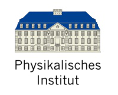

## A Journal Club on Condesed Matter Theory
## Physikalisches Institut, Uni Bonn

## Upcoming Schedule:

**2. October 26, 2022**

**Speaker:** Prof. David Luitz

**Title:** TBA

Indico Link: [https://indico.hiskp.uni-bonn.de/event/148/](https://indico.hiskp.uni-bonn.de/event/148/)

**3. November 2, 2022**

**Speaker:**  TBA

**Title:** TBA

Indico Link: [https://indico.hiskp.uni-bonn.de/event/148/](https://indico.hiskp.uni-bonn.de/event/148/)

**4. Movember 9, 2022**

**Speaker:**  Philipp Höllmer (AG Monien)

**Title:** Bringing the power of Monte Carlo methods to long-range-interacting molecular systems

**Abstract:** 

Molecular simulations are widespread in molecular sciences to study, e.g., protein folding. Here, chemical systems are modeled empirically by a set of atomic positions with parameterized interaction potentials. Nowadays, molecular-dynamics (MD) simulations are predominantly used to study long-range-interacting molecular systems because of their superior computational complexities and Newtonian dynamics when compared to traditional Markov-chain Monte Carlo (MCMC) simulations. We argue that both disadvantages of traditional reversible MCMC are overcome by event-chain Monte Carlo (ECMC), which is a family of non-reversible MCMC methods.

In this talk, we will explore how ECMC samples the equilibrium Boltzmann distribution exactly, although it uses non-equilibrium dynamics and never computes the total system potential. We will discuss how ECMC's sole restriction of the global-balance condition yields a great freedom to implement quickly decorrelating dynamics beyond Newtonian's dynamics of MD. This freedom is evidenced by various variants of ECMC that show widely different performances depending on the specific use case. Finally, we will demonstrate O(N log N) scaling for ECMC's decorrelation of an N-body system of a commonly used long-range-interacting water model. This matches the performance of MD without ever discretizing time or space.

Collaborators: N. Noirault (ENS Paris), B. Li (ENS Paris), A. C. Maggs (ESPCI Paris), W. Krauth (ENS Paris)

Indico Link: [https://indico.hiskp.uni-bonn.de/event/148/](https://indico.hiskp.uni-bonn.de/event/148/)

## Past Talks

**1. October 19, 2022**

**Speaker:** Marvin Lenk (AG Kroha)

**Title:** Heavy-Fermion Systems and Some Exotic Examples

**Abstract:** 

In this talk I will discuss the physics of heavy-fermion systems and my current research in this field, including topological systems and exotic effects in this category. Starting from simple concepts in condensed matter theory and quantum mechanics, I will briefly explain the origin of the Kondo effect and how heavy Kondo-bands can form in real-world alloys. In that context, dynamical mean-field theory (DMFT) and the non-crossing approximation (NCA) will be briefly discussed as methods to numerically solve such systems. Finally, I will present results of applying these methods to solve bulk topological Kondo-insulators like SmB6 and the quadrupolar two-channel Kondo effect in PrV2Al20.

Indico Link: [https://indico.hiskp.uni-bonn.de/event/146/](https://indico.hiskp.uni-bonn.de/event/146/)

[[Slides](https://sagnikiiser.github.io/CondMat-Bonn/Slides-Marvin.pdf)],
[[Poster](https://sagnikiiser.github.io/CondMat-Bonn/JC-Poster.pdf)]

**Link for Zulip:**

[https://condmat-bonn.zulipchat.com](https://condmat-bonn.zulipchat.com/)

